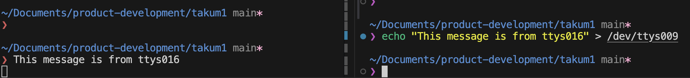

composeファイルで`tty`と`stdin_open`の指定がされている箇所が具体的に何をしているのかわからなかったため調べてみた。

## ttyについて
[composeファイルの説明](https://docs.docker.jp/compose/compose-file/index.html#tty)によると

>tty は、サービス コンテナに TTY を使って実行するよう設定します。

とのこと。
うーん、わからん、

わからんので、そもそもttyというもの自体がなんなのか調べてみると、どうやらUnix系コマンドとしてttyが用意されているみたい。
ttyはteletypewriterの略で、接続端末のデバイスファイル名を出力してくれる。

実行してみる

```bash
❯ tty
/dev/ttys009
```

ttys009というデバイスファイルが出力された。
接続端末もデバイスファイルで管理されているため、ファイルに対して入力をリダイレクトさせると別端末にメッセージを出力できる。

以下の記事がわかりやすかった
https://zenn.dev/hohner/articles/43a0da20181d34



つまり、composeファイルでtty: trueを設定すると接続端末を使ってコンテナとやりとりできるようになるということ。

## stdin_openについて
composeファイルの説明によると

>stdin_open は、サービス コンテナに標準入力を割り当てて実行するよう設定します。

この設定をtrueにしないと、コンテナ内での標準入力ができなくなってしまう。

## 実験
tty, stdin_openの設定が実際にどのような影響を及ぼすのかpythonコンテナを用いて確かめてみる。

用意するDockerfile
```Dockerfile
FROM python:3.13.3-alpine3.21
```

このDockerfileからイメージを作成してコンテナに接続する

まずは、-t（tty）を指定するだけで-i（stdin_open）は設定しない場合

```bash
docker container run --rm -t --name python_3 python_3.13.3 sh
```

実行するとコンテナ内に入れたが、標準入力を受け付けない状態。
`stdin_open は、サービス コンテナに標準入力を割り当てて実行するよう設定します。`という説明の通り、stdin_openの設定を有効にすることで標準入力を割り当ててくれる。

次に、-t（tty）を設定しない場合
```bash
docker container run --rm -i --name python_3 python_3.13.3 sh
```

実行するとコンテナに接続できない状態になった。
仮装端末が割り当てられていないため、そもそも標準入力できなくなっている。


## 参考
https://ohbarye.hatenablog.jp/entry/2019/05/05/learn-tty-with-docker
https://zenn.dev/hohner/articles/43a0da20181d34
