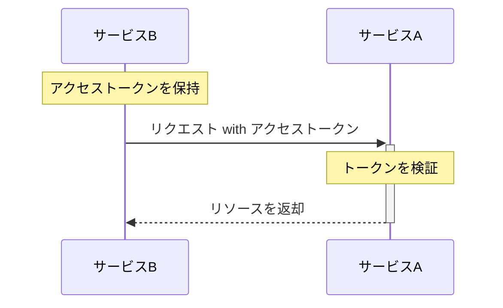

実務で認証基盤周りを触ることになり、OAuthやOIDCなどの認証・認可フレームワークを理解する必要がでてきたため、OAuthとな何なのかというところから理解していくことにした。

## OAuthとは何か？

RFC6749やその他資料を読んで以下のように理解した。
>認証情報を共有することなく、アクセストークンを使ってリソースへの限定的なアクセス権を得るための認可の枠組み

以下のような場面を考える。

- ユーザのデータが存在するサービスA（GoogleやGitHubなど）がある
- サービスBはサービスAに存在するユーザのリソース（データや機能）を使いたい
  - 例えば、
  - 写真共有サービス（サービスB）がGoogle Photo内の写真をアップロードできるようにしたい場合など

当然だが、サービスAはサービスBに対してパスワードなどの認証情報はなるべく（いや、絶対に）教えたくはない。
パスワード漏洩のリスクがあるからだ。

では、どのようにしてサービスBはサービスAのリソースにアクセスすればいいのだろうか？
あらかじめ、サービスAの特定のデータだけ取得できる権限が付与されたアクセストークンを発行しておき、サービスBはそれをリクエスト時に送ることで認証情報を共有することなくリソースへアクセスできる。

図ではサービスBが初めからアクセストークンを保持している状態だが、アクセストークンは「認可サーバ」と呼ばれるサーバから取得する。認可サーバとアプリケーション（この節で言うとサービスB）間のアクセストークンのやり取りの仕方もOAuthでは標準化されている。

## OAuthに登場する4つのロール
OAuthには4つのロールが定義されている。

**リソース所有者（エンドユーザ）**
保護されたリソース（Google内の写真やX内のツイートなど）へのアクセスを許可できるエンティティ。リソース所有者が人間の場合はエンドユーザと呼ばれる。

**リソースサーバ**
保護されたリソースをホストし、アクセストークンを使用して保護されたリソース要求を受け入れ、応答できるサーバ

**クライアント**
リソース所有者に代わって、保護されたリソースに対してリクエストを行うアプリケーション。

**認可サーバ**
リソース所有者を認証して、認可取得が成功した後、アクセストークンをクライアントに発行するサーバ

## プロトコルフロー
上記の4つのロールを踏まえて保護されたリソースを取得するまでのフローは以下のようになる

<!--  -->

[Abstract Protocol Flow - RFC6749](https://datatracker.ietf.org/doc/html/rfc6749#section-1.2)

**A:** クライアントはリソース所有者に対して認可を要求する。リソース所有者に直接認可要求を行うことも出来るが、認可サーバを介して間接的に行うことが推奨されている。

**B:** クライアントはリソース所有者の「許可グラント」を受け取る。

**C:** クライアントは認可サーバーで認証し、「認可グラント」を提示することでアクセストークンを要求する。

**D:** 認可サーバーはクライアントを認証し、「認可グラント」を検証する。「認可グラント」が正当であれば、アクセストークンを発行する。

**E:** クライアントは保護されたリソースをリソースサーバへ要求し、アクセストークンを提示して認証する。

**F:** リソースサーバーはアクセストークンを検証し、有効な場合はリクエストを処理する。

## 認可グラント（Authorization Grant）
認可グラントは、リソース所有者の認可を表す情報のこと。この認可グラントを使うことで、保護されたリソースにアクセスするためのアクセストークンを取得することができる。

仕様では、以下の4つのグラントタイプを定義している。

- 認可コード（Authorization Code）
- インプリシット（Implicit）
- リソースオーナーパスワードクレデンシャル（Resource Owner Password Credentials）
- クライアントクレデンシャル（Client Credentials）

「認可コード」については別記事で解説しようと思う。

## まとめ
OAuth2.0の概要がざっくり理解できた。次はRubyを使って実際にOAuthを使って認可処理をするハンズオンとかやりたい。OIDCについての記事もそのうち書く。
